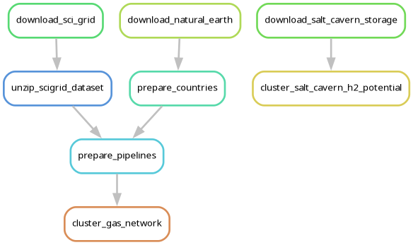
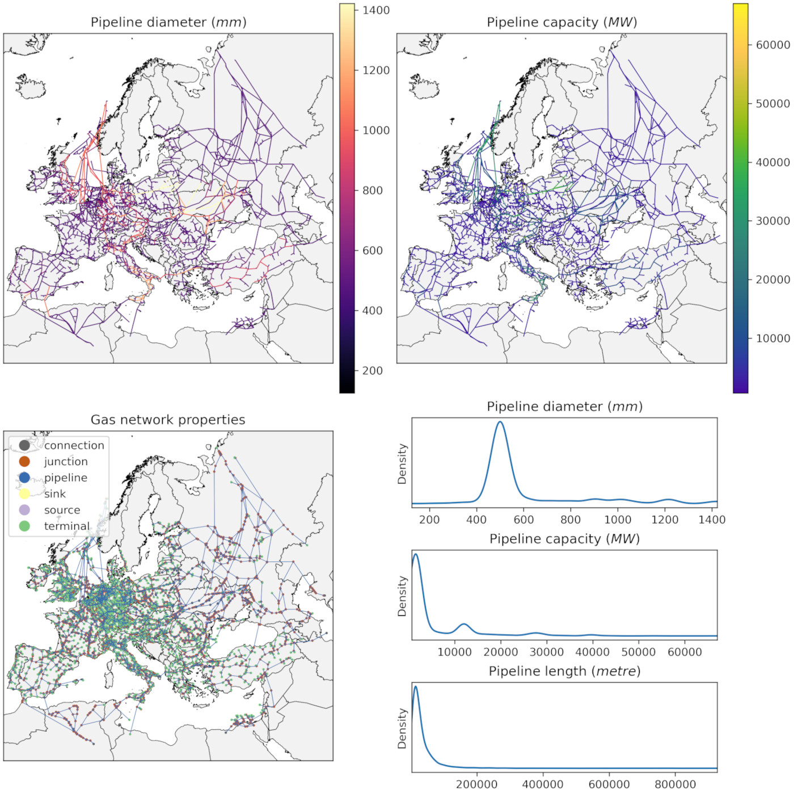

# Module Euro Gas Grid

A module to cluster European gas networks into any resolution.

## About this module
<!-- Please do not modify this templated section -->

This is a modular `snakemake` workflow built for [Modelblocks](https://www.modelblocks.org/) data modules.

This module can be imported directly into any `snakemake` workflow.
For more information, please consult:
- The Modelblocks [documentation](https://modelblocks.readthedocs.io/en/latest/).
- The integration example in this repository (`tests/integration/Snakefile`).
- The `snakemake` [documentation on modularisation](https://snakemake.readthedocs.io/en/stable/snakefiles/modularization.html).

## Development
<!-- Please do not modify this templated section -->

We use [`pixi`](https://pixi.sh/) as our package manager for development.
Once installed, run the following to clone this repository and install all dependencies.

```shell
git clone git@github.com:modelblocks-org/module_euro_gas_grid.git
cd module_euro_gas_grid
pixi install --all
```

For testing, simply run:

```shell
pixi run test-integration
```

To test a minimal example of a workflow using this module:

```shell
pixi shell    # activate this project's environment
cd tests/integration/  # navigate to the integration example
snakemake --use-conda --cores 2  # run the workflow!
```

## Documentation

### Overview
<!-- Please describe the processing stages of this module here -->
The analysis of the module is structured as follows:

<div style="width:50%; margin: auto;">


</div>

1. Generic data necessary for processing is downloaded and stored locally.
2. The SciGrid-Gas dataset is processed to compute per-pipeline capacity (in $MW$). If configured, several imputations may be applied to counteract overestimations, based on [PyPSA-Eur](https://github.com/PyPSA/pypsa-eur) algorithms.
<div style="width:70%; margin: auto;">


</div>

3. Geospatial input polygons ('shapes' provided by the user) are used as basis to aggregate both gas pipelines and salt cavern $H_2$ storage.
4. Gas pipelines are converted into a network graph and then aggregated into three types of node using a [maximum flow algorithm](https://networkx.org/documentation/networkx-3.6/reference/algorithms/generated/networkx.algorithms.flow.preflow_push.html).
    - shape terminals: the centroids of the provided shapes.
    - outside terminals: the centroids of adjacent 'external' nations (at national resolution based on Natural Earth Admin 0 regions).
    Useful if you wish to estimate import limits in your model.
    - hubs: aggregated offshore pipeline components that connect to >= 3 terminals. A maximum per-hub throughput capacity limit is provided.
    <div style="width:50%; margin: auto;">

    
    </div>

5. Salt caverns are grouped into three types: onshore, nearshore and offshore. A total sum is also provided.
<div style="width:70%; margin: auto;">


</div>


### Configuration
<!-- Feel free to describe how to configure this module below -->

Please consult the configuration [README](./config/README.md) and the [configuration example](./config/config.yaml) for a general overview on the configuration options of this module.

### Input / output structure
<!-- Feel free to describe input / output file placement below -->

As input, all you need to provide is a Geoparquet file with the polygons (i.e., 'shapes') to aggregate capacities into. This file should follow the schema provided by the [geo-boundaries module](https://github.com/modelblocks-org/module_geo_boundaries/).

Outputs for each processed input shapes file are:
- For the gas network, files describing the network topology in the form of hubs, nodes, and pipelines (edges).
- For salt caverns, a file describing the storage potential of each region.

Please consult the [interface file](./INTERFACE.yaml) for more information.

### References
<!-- Please provide thorough referencing below -->

This module is based on the following research and datasets:

-  **Gas network dataset:**
Diettrich, J., Pluta, A., Medjroubi, W., Dasenbrock, J., & Sandoval, J. E. (2021). SciGRID_gas IGGIELGNC-3 (0.2) [Data set]. Zenodo. <https://doi.org/10.5281/zenodo.5079748>.
- **Salt cavern dataset:**
Caglayan, D. G., Weber, N., Heinrichs, H. U., Linßen, J., Robinius, M., Kukla, P. A., & Stolten, D. (2020). Technical potential of salt caverns for hydrogen storage in Europe. International Journal of Hydrogen Energy, 45(11), 6793-6805. <https://doi.org/10.1016/j.ijhydene.2019.12.161>.
- **National boundaries (used as reference for external trade):**
Natural Earth Admin 0 - Countries at 10m resolution. <https://www.naturalearthdata.com/downloads/10m-cultural-vectors/10m-admin-0-countries/>
- **Original source-code / inspiration:**
    - Brown, T., Victoria, M., Zeyen, E., Hofmann, F., Neumann, F., Frysztacki, M., Hampp, J., Schlachtberger, D., Hörsch, J., Schledorn, A., Schauß, C., van Greevenbroek, K., Millinger, M., Glaum, P., Xiong, B., & Seibold, T. PyPSA-Eur: An open sector-coupled optimisation model of the European energy system (Version v2025.07.0). Computer software.<https://github.com/pypsa/pypsa-eur>.
    - Neumann, F., Zeyen, E., Victoria, M., & Brown, T. (2023). The potential role of a hydrogen network in Europe. Joule, 7(8), 1793-1817. <https://doi.org/10.1016/j.joule.2023.06.016>.
    - Hofmann, F., Tries, C., Neumann, F. et al. H2 and CO2 network strategies for the European energy system. Nat Energy 10, 715–724 (2025). <https://doi.org/10.1038/s41560-025-01752-6>.
- **Shape schema definition:**
Ruiz Manuel, I. Modelblocks - module_geo_boundaries. Computer software. <https://github.com/calliope-project/module_geo_boundaries/>.
