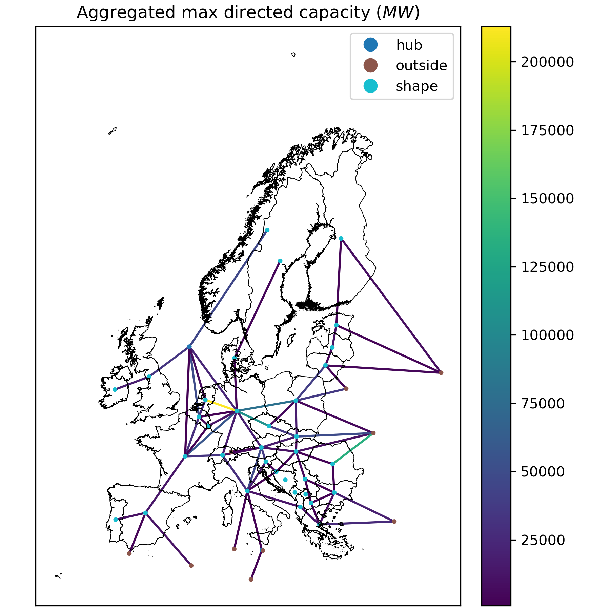

# Module Euro Gas Grid

A module to disaggregate gas networks and $H2$ salt cavern storage for European regions.



A modular `snakemake` workflow built for [`clio`](https://clio.readthedocs.io/) data modules.

> [!NOTE]
> This module is based on the work of the [PyPSA-Eur](https://github.com/PyPSA/pypsa-eur) model.

## Using this module

This module can be imported directly into any `snakemake` workflow.
Please consult the integration example in `tests/integration/Snakefile` for more information.

## Development

We use [`pixi`](https://pixi.sh/) as our package manager for development.
Once installed, run the following to clone this repo and install all dependencies.

```shell
git clone git@github.com:calliope-project/module_euro_gas_grid.git
cd module_euro_gas_grid
pixi install --all
```

For testing, simply run:

```shell
pixi run test-integration
```

To test a minimal example of a workflow using this module:

```shell
pixi shell    # activate this project's environment
cd tests/integration/  # navigate to the integration example
snakemake --use-conda --cores 2  # run the workflow!
```
