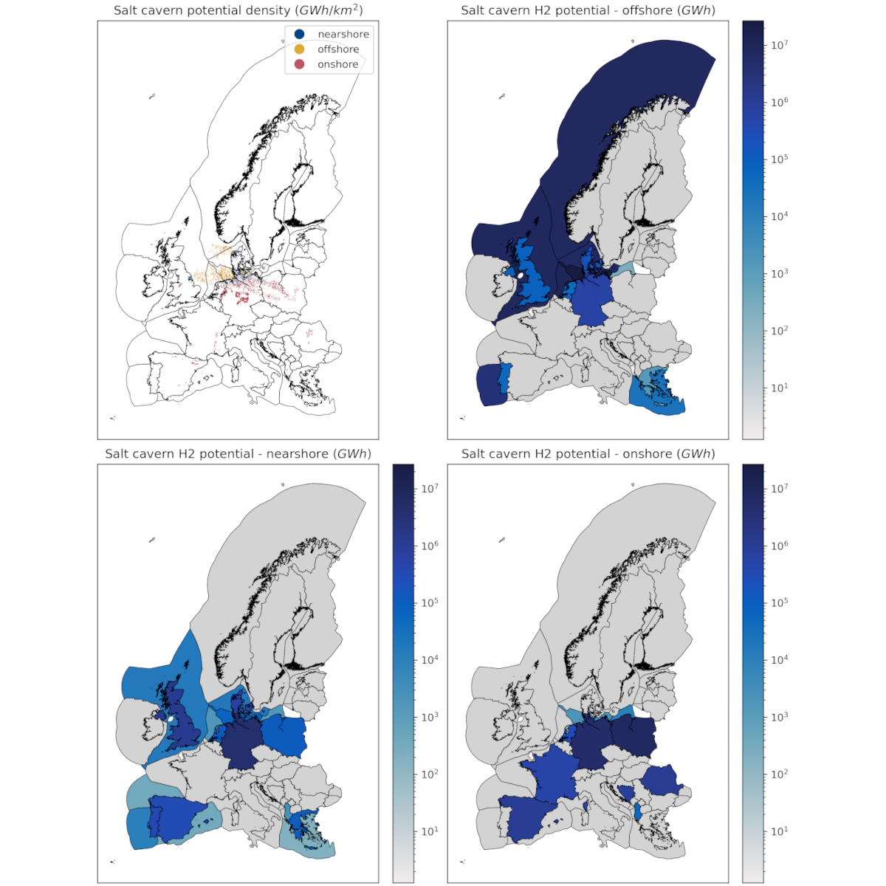

# Euro gas grid

Welcome to the documentation of the `module_euro_gas_grid` data module!
This module performs geospatial aggregation of gas pipelines in Europe using the SciGrid-Gas dataset as its baseline.

Please consult the [specification guidelines](./specification.md) and the [`clio` documentation](https://clio.readthedocs.io/) for more information.

## Overview

The analysis of the module is structured as follows:

1. Generic data necessary for processing is downloaded and stored locally.
1. The SciGrid-Gas dataset is processed to compute per-pipeline capacity (in $MW$). If configured, several imputations may be applied to counteract overestimations, based on PyPSA-Eur algorithms.
1. Geospatial input polygons ('shapes' provided by the user) are used as basis to aggregate both gas pipelines and salt cavern $H_2$ storage. These shapes follow the schema provided by [geo-boundaries module](https://github.com/calliope-project/module_geo_boundaries/tree/v0.1.6).
1. Gas pipelines are converted into a network graph and then aggregated into three types of node using a [maximum flow algorithm](https://networkx.org/documentation/networkx-3.6/reference/algorithms/generated/networkx.algorithms.flow.preflow_push.html).
    - shape terminals: the centroids of the provided shapes.
    - outside terminals: the centroids of adjacent 'external' nations (at national resolution based on Natural Earth Admin 0 regions).
    They are useful if you wish to estimate import limits in your model.
    - hubs: aggregated offshore pipeline components that connect to >= 3 terminals. A maximum per-hub throughput capacity limit is provided.
    
1. Salt caverns are grouped into three types: onshore, nearshore and offshore. A total sum is also provided.

## Configuration

See [the configuration README](./../config/README.md).

## Outputs

See the [interface file](./../INTERFACE.yaml).

## Data sources

- Diettrich, J., Pluta, A., Medjroubi, W., Dasenbrock, J., & Sandoval, J. E. (2021). SciGRID_gas IGGIELGNC-3 (0.2) [Data set]. Zenodo. <https://doi.org/10.5281/zenodo.5079748>.
- Natural Earth Admin 0 - Countries at 10m resolution. <https://www.naturalearthdata.com/downloads/10m-cultural-vectors/10m-admin-0-countries/>
- Caglayan, D. G., Weber, N., Heinrichs, H. U., Linßen, J., Robinius, M., Kukla, P. A., & Stolten, D. (2020). Technical potential of salt caverns for hydrogen storage in Europe. International Journal of Hydrogen Energy, 45(11), 6793-6805. <https://doi.org/10.1016/j.ijhydene.2019.12.161>.

> [!NOTE]
> The Caglayan dataset is based on a version used for the PyPSA-Eur model. For more information see <https://zenodo.org/records/18153129>.

## References

This module relies on code and methods from the following sources.

- [Brown, T., Victoria, M., Zeyen, E., Hofmann, F., Neumann, F., Frysztacki, M., Hampp, J., Schlachtberger, D., Hörsch, J., Schledorn, A., Schauß, C., van Greevenbroek, K., Millinger, M., Glaum, P., Xiong, B., & Seibold, T. PyPSA-Eur: An open sector-coupled optimisation model of the European energy system (Version v2025.07.0) [Computer software].](https://github.com/pypsa/pypsa-eur)
- Neumann, F., Zeyen, E., Victoria, M., & Brown, T. (2023). The potential role of a hydrogen network in Europe. Joule, 7(8), 1793-1817. <https://doi.org/10.1016/j.joule.2023.06.016>.
- [Ruiz Manuel, I. clio - module_geo_boundaries [Computer software].](https://github.com/calliope-project/module_geo_boundaries/)
